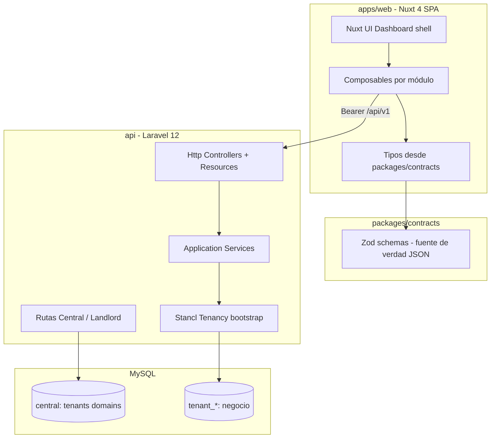
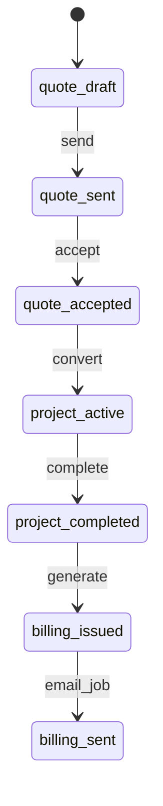

# Arquitectura — Freelance System

**Versión del documento:** 1.0.0  
**BD:** MySQL 8 · **Auth:** Sanctum Bearer · **Tenancy:** Stancl (BD por tenant)

---

## 1. Objetivo del producto

Gestión integral para un desarrollador freelance (y futuras empresas/tenants):

- **Clientes** con datos para plantillas (cotización, cuenta de cobro).
- **Cotizaciones** con PDF custom.
- **Proyectos** (desde cotización aceptada; tipos: freelance, fijo, retainer).
- **Pagos** (parciales hasta saldo cero; ver [PROJECTS.md](./PROJECTS.md)).
- **Finanzas** — ingresos (proyecto al cobrar + **manuales**) y gastos; balance mensual ([FINANCES.md](./FINANCES.md)).
- **Cuentas de cobro** al completar proyecto → PDF + cola de email.

**v1:** un usuario real, tenant `personal`. **ADN:** multi-tenant listo para empresa constituida o SaaS futuro.

---

## 2. Diagrama de capas



---

## 3. Monorepo

```txt
freelance-system/
├── AGENTS.md
├── .agents/skills/
├── .cursor/rules/
├── docs/main/
├── docs/plans/
├── packages/contracts/
├── api/                 # Laravel 12 (scaffold fase 1)
├── apps/web/            # Nuxt 4 ui/dashboard (scaffold fase 2)
├── scripts/
├── docker-compose.dev.yml
├── package.json
└── pnpm-workspace.yaml
```

---

## 4. Responsabilidades por capa

| Capa                   | Hace                                                          | No hace                                                       |
| ---------------------- | ------------------------------------------------------------- | ------------------------------------------------------------- |
| **Nuxt**               | UI, orquestación de pantalla, formateo de dinero para display | Reglas de negocio, totales fiscales definitivos, persistencia |
| **packages/contracts** | Shape JSON estable, tipos TS                                  | Lógica de runtime                                             |
| **Laravel Http**       | HTTP, auth, delegación                                        | Cálculos de saldo, conversión quote→project                   |
| **Application**        | Casos de uso, transacciones, orquestación delgada             | SQL crudo en controladores                                    |
| **Support/Money**      | Motor en centavos, IVA opcional                               | —                                                             |
| **Stancl**             | Bootstrap tenant, migrate/run, storage/queue por tenant       | Dominio de cotizaciones                                       |

---

## 5. Backend — Clean Architecture pragmática

No hay carpeta `Domain` pesada al inicio. Sí separación clara:

```txt
api/app/
├── Domain/                      # Solo reglas puras
│   ├── Money/
│   └── Billing/                 # enums, value objects
├── Application/
│   ├── Clients/
│   ├── Quotes/
│   ├── Projects/
│   ├── Payments/
│   ├── Finances/
│   └── Billing/
├── Http/
│   ├── Controllers/Api/Central/
│   ├── Controllers/Api/Tenant/
│   ├── Requests/
│   └── Resources/
├── Models/
│   ├── Tenant.php               # Stancl landlord
│   └── Tenant/                  # Eloquent solo BD tenant
└── Support/
    ├── Money/MoneyMath.php
    └── Context/ApplicationContext.php
```

### Reglas de orquestación

- **Controller:** valida auth + delega; sin negocio.
- **Form Request:** validación de entrada alineada a `packages/contracts`.
- **Service:** coordina; si mezcla 3+ responsabilidades → extraer `Action` o `Support/*`.
- **API Resource:** respuesta = contrato público.
- **Job:** PDF, email tras eventos (`ProjectCompleted`).

---

## 6. Frontend — módulos y composables

Basado en [Nuxt UI Dashboard](https://github.com/nuxt-ui-templates/dashboard), `ssr: false`.

**UX:** entidades en **vistas dedicadas** (`/projects/[id]`, `/clients/[id]`, …), no modales como pantalla principal. Ver [UI_ROUTES.md](./UI_ROUTES.md). Skills de diseño: `modern-web-guidance`, `frontend-design`, `accessibility`.

### Taxonomía

| Artefacto                                  | Rol                            |
| ------------------------------------------ | ------------------------------ |
| `useXApi.ts`                               | Solo HTTP                      |
| `useXFormState.ts`                         | Estado reactivo del formulario |
| `hydrateXForm.ts` / `serializeXPayload.ts` | API ↔ UI                       |
| `useXSubmit.ts`                            | Submit + errores               |
| `useX.ts`                                  | Orquestador delgado            |
| Componentes `ui/`, `forms/`, `sections/`   | Presentación; props/emits      |
| `modals/` o `<dialog>`                     | Solo confirmaciones breves     |

### Módulos

`clients`, `quotes`, `projects`, `payments`, `finances`, `billing`

### Pinia (mínimo)

- `auth` — token, user
- `tenant` — slug, settings (`tax_enabled`, currency)

Hub HTTP: `composables/api/useApi.ts` (guards, Bearer, errores centralizados).

---

## 7. Contratos API (`packages/contracts`)

Flujo de cambio:

1. Actualizar schema Zod en `packages/contracts`.
2. Ajustar Form Request + API Resource en Laravel.
3. Ajustar composables TS (tipos inferidos o generados).
4. Test de contrato con fixture JSON.

Versión URL: `/api/v1`. Breaking → `/api/v2`.

---

## 8. Errores API (fase 4.5)

Contrato único para errores en todas las respuestas JSON: `ApiErrorSchema` en `packages/contracts`.

### Formato

```json
{
  "message": "The given data was invalid.",
  "errors": {
    "email": ["The email field must be a valid email address."]
  }
}
```

### Frontend — capa de parsing

- `parseApiError(error)` → `ParsedApiError` con `kind`, `status`, `message`, `fieldErrors`.
- `useApiError()` → helpers UI: `toastApiError`, `getFieldError`, `logApiError`.
- Los catch de todos los formularios y acciones usan `toastApiError` con `fallback` contextual.

### Backend — consistencia

- Siempre Form Request (nunca `$request->validate()` en controller).
- `attributes()` en Form Requests para nombres de campo en español.
- 404 → `ModelNotFoundException` o excepción de dominio con mensaje claro.

Ver plan detallado: [`docs/plans/phase-04.5-error-handling.md`](../plans/phase-04.5-error-handling.md).

---

## 9. Motor monetario e IVA

| Regla                     | Valor                                               |
| ------------------------- | --------------------------------------------------- |
| Almacenamiento            | Enteros (`*_cents`)                                 |
| UI                        | Solo `formatMoney()`                                |
| IVA por defecto           | **Apagado** (`tenant.settings.tax_enabled = false`) |
| Motor                     | `Support/Money/MoneyMath.php` único                 |
| Modos (cuando IVA activo) | `net_first`, `gross_first`                          |
| Anti-patrón               | `* 1.19` en Vue o PHP fuera del motor               |

Campos de línea (tenant DB): `unit_amount_cents`, `quantity`, `tax_rate`, `tax_cents`, `line_total_cents`.

---

## 10. Flujos de negocio



- Pagos en `project_active` actualizan `balance_due_cents` y pueden generar ingreso en **Finanzas** (ver [FINANCES.md](./FINANCES.md)).
- Cuenta de cobro al completar proyecto **no** es ingreso hasta que haya cobro (pago) o ingreso manual.
- Ingresos automáticos: `source_type` + `source_id` (ej. `project_payment`). Ingresos manuales (rifa, etc.): `source_type=manual`, CRUD desde Finanzas.

---

## 11. Permisos (evolución)

| Fase   | Enfoque                                                |
| ------ | ------------------------------------------------------ |
| v1     | Un usuario owner por tenant; middleware `auth:sanctum` |
| v2     | Spatie Permission en BD tenant                         |
| Futuro | Rutas `central` para admin de plataforma               |

Usuarios en **BD tenant** (recomendado con Stancl). Central: `tenants`, `domains` únicamente en v1.

---

## 12. Decisiones cerradas

| Tema        | Decisión                                          |
| ----------- | ------------------------------------------------- |
| Template UI | Nuxt UI Dashboard en `apps/web`                   |
| API         | Laravel 12 en `api/`                              |
| Tenancy     | Stancl + patrones central/tenant (ver TENANCY.md) |
| BD          | **MySQL 8**                                       |
| Auth        | **Sanctum Bearer token**                          |
| IVA         | Motor sólido; desactivado por defecto             |
| Contratos   | `packages/contracts` primero                      |

---

## 13. Referencias

- [TENANCY.md](./TENANCY.md)
- [ENGINEERING_GUARDRAILS.md](./ENGINEERING_GUARDRAILS.md)
- [ONBOARDING.md](./ONBOARDING.md)
- [FINANCES.md](./FINANCES.md)
- [UI_ROUTES.md](./UI_ROUTES.md) — rutas y vistas completas
- [PROJECTS.md](./PROJECTS.md) — pagos parciales en detalle de proyecto
- [bootstrap.md](../plans/bootstrap.md)
- [AGENTS.md](../../AGENTS.md)
